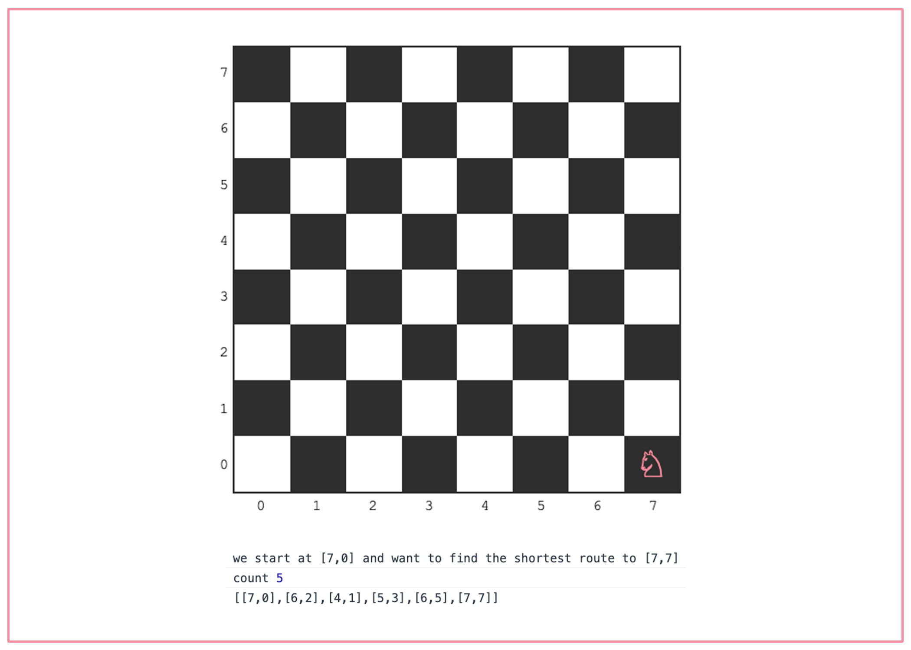

# Knights Travails

## Result

[Try the Knights Travails **console version** here](https://manonlef.github.io/knights-travails/)

## About this project

This project is the final assignment of the computer science module where topics were covered like [linked lists](https://github.com/ManonLef/linked-list), recursion([fibonacci](https://github.com/ManonLef/TOPpractice/blob/main/JS%20course/CS/Recursion/fibonacci/fibonacci.js) and [mergeSort](https://github.com/ManonLef/TOPpractice/blob/main/JS%20course/CS/Recursion/mergeSort/merge-sort.js)), space and time complexity and search algorithms.
It was prefaced with a lot of exercises.

The lengthy [Binary Search Tree project](https://github.com/ManonLef/bst/tree/main) which we did before this was the one that helped me the most during this project.

## Behavior during initial release June 2023

- the knight will randomly be positioned on the board (code has other options like default coordinates and manual coordinates)
- the currently set target coordinates are [7,7]
- the shortest path and step count will be logged in the browser console

## Objectives

- [x] use a data structure similar (but not identical to) a binary tree
- [x] put together a script that creates a game board and a knight
- [x] Treat all possible moves the knight could make as children in a tree. Don’t allow any moves to go off the board
- [x] Decide which search algorithm is best to use for this case
- [x] Use the chosen search algorithm to find the shortest path between the starting square (or node) and the ending square. Output the full path
- [ ] build a function `knightMoves` that shows the shortest possible way to get from one square to another by outputting all squares the knight will stop on along the way 

## Notes

During this project I also took some notes that you can find unedited [here](./resources-and-notes/notes.md)

### DFS vs DFS
I started with a full DFS traversal setup and that overcomplicated things a lot. I got myself rather stuck in the complexity and after a good night's sleep I decided to start over with some pseudocode. I realized that my intention was to do a BFS but I was implementing that in a recursive DFS fashion. 
Once I started over with a function similar to my BST levelOrder BFS function, it all started forming smoothly.

### UI
The night I started this, I made a UI for the gameBoard only to realize that the gameBoard could have just been an array filled with coordinates.
I decided to keep the visual representation and use it to make this a UI project and take the steps out of the console eventually.

## Things to improve or add
- [ ] The code definitely still needs a clean up / refactor
- [ ] UI
  - [ ] Let user input start and end or choose random
  - [ ] animate the knight and/or highlight path
  - [ ] display the shortest path on the screen